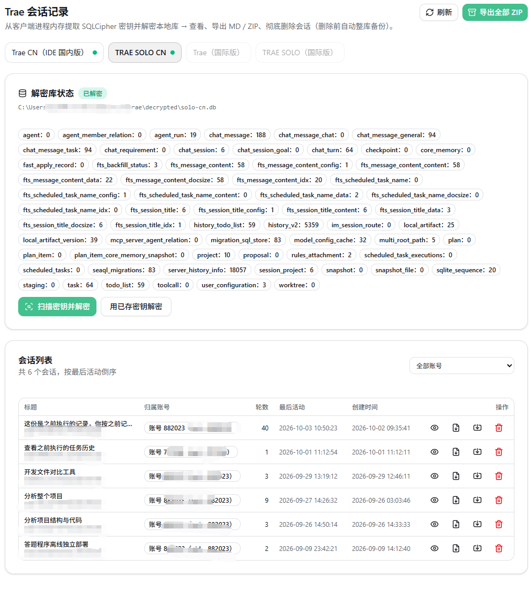

# trae-switch-cn

Trae（国内版）多账号切换桌面 App（Tauri 2 + React + Rust）。面向国内版 Trae 桌面客户端：账号管理、一键切换（含守护回滚）、会话记录解密 / 导入 / 导出 / 删除、记忆交接与网页凭证登录。

<p align="center">
  
</p>

## 开发背景

[workbuddy-switch](https://github.com/changexbc/workbuddy-switch) 为 CodeBuddy 实现了多账号切换并保留会话记录的能力；而 Trae 一直缺少同类工具——多账号只能反复退出重登，会话记录也随账号切换而不可见。本项目沿袭这一思路，为 Trae（国内版）补齐「账号切换 + 会话记录保留」的能力：本地会话库加密解密、按账号维度导入 / 导出 / 删除，让多账号与记录不再互斥。

## 功能

| 模块 | 说明 |
| --- | --- |
| 账号管理 | 网页凭证登录（OAuth 回环）、账号备份 / 导入导出 / 重命名 / 删除 |
| 账号切换 | 一键切换 Trae 登录账号，切换过程实时显示进度；失败自动回滚到原账号并重新拉起 |
| 会话记录 | 扫描密钥并解密本地会话库；按账号浏览会话详情；会话导出 / 批量导出 / 导入到指定账号；彻底删除（整库备份 → 删行 → 加密回写 → 移入回收站） |
| 记忆交接 | 切换前把当前进度写成换账号后仍可读的交接记忆（项目目录 + 工具归档） |

## 使用教程

### 1. 安装

从 [Releases](https://github.com/bean0283/trae-switch-cn/releases) 下载 `trae-switch-cn_0.0.1_x64-setup.exe`（NSIS 版，推荐）或 MSI 版，双击安装后从开始菜单 / 桌面快捷方式启动。

### 2. 账号管理

启动后进入「Trae 账号管理」页：

- **网页登录**：点击「登录 Trae 账号」，按提示发起网页登录，浏览器完成授权后账号自动入库；
- **账号切换**：在账号卡片上点击「切换」，应用会终止 Trae 进程 → 还原目标账号载体 → 重启客户端，期间显示实时进度；切换失败自动回滚到原账号；
- **账号维护**：支持备份 / 导出 / 导入 / 重命名 / 删除账号。

> 截图：Trae 账号管理页
>
> 

### 3. 会话记录

进入「Trae 会话记录」页：

1. **扫描密钥并解密**：点击「扫描密钥并解密」，程序扫描 Trae 进程内存 / 本地存储，验证密钥后把加密会话库解密到 `~/.trae-switch-cn/decrypted/`；
2. **浏览会话**：按账号筛选会话列表，点击进入会话详情查看消息；
3. **导入**：把其它账号 / 客户端的已解密会话导入到目标账号（同库复制，云端归属目标账号）；
4. **删除**：勾选会话后彻底删除——先备份整库，再对实时加密库删行并加密回写，原库备份保留在 `~/.trae-switch-cn/backup/`，删除的会话归档到 `~/.trae-switch-cn/deleted_sessions/`。

> 截图：Trae 会话记录页
>
> 

> 提示：Trae 重启后本地密钥可能变化，重新解密前请再次「扫描密钥并解密」。

## 数据目录

- 应用状态与已保存密钥：`~/.trae-switch-cn/`
- 解密输出：`~/.trae-switch-cn/decrypted/`
- 删除的会话归档：`~/.trae-switch-cn/deleted_sessions/`
- 原库整库备份：`~/.trae-switch-cn/backup/`

可用环境变量 `TRAE_SWITCH_HOME` 覆盖家目录（测试沙箱 / 自定义部署）。

## 开发

```bash
npm install        # 安装前端依赖
npm run tauri dev  # 本地开发（vite + cargo）
```

打包安装包（NSIS / MSI）：

```bash
npm run tauri build
```

## 支持范围

| 客户端 | 账号切换 | 会话解密 | 会话导入 | 会话删除 |
| --- | --- | --- | --- | --- |
| Trae（国内版） | ✅ | ✅ | ✅ | ✅ |

## 致谢

本项目受以下开源项目启发与支持：

- [changexbc/workbuddy-switch](https://github.com/changexbc/workbuddy-switch) —— 多账号切换 + 记录保留思路的源头，账号载体合成与切换流程参考于此
- [yiyiqd/trae-session-export](https://github.com/yiyiqd/trae-session-export) —— Trae 本地会话库解密方案的参考实现

## 许可协议

[MIT License](LICENSE)（Copyright © 2026 trae-switch-cn）
